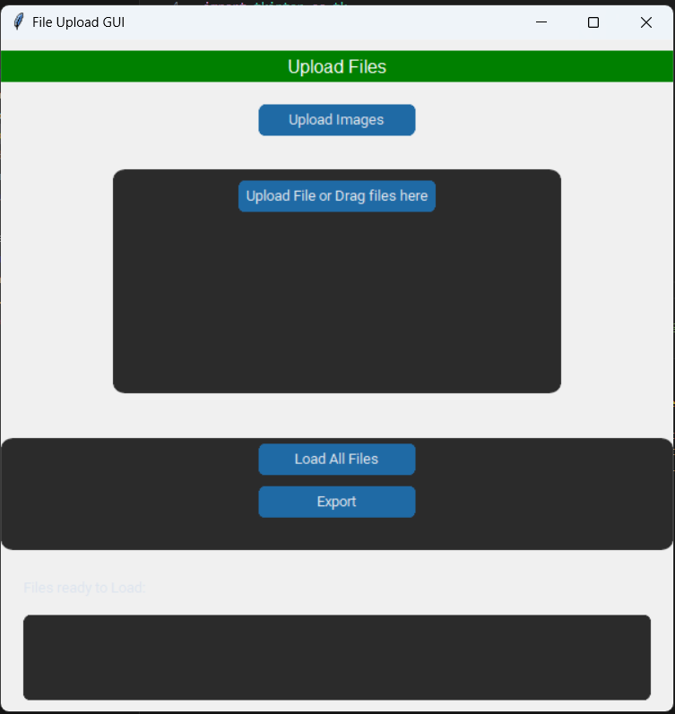

# NeuroFinder Processing Tool

This project is designed to automate the process of managing a large database of company information. The tool supports the import, formalization, validation, and updating of company data files in various formats (e.g., CSV, Excel). The process is visualized in the flowchart provided.

## Steps
0. Get the databases from the start up nation and crunch base
1. Updating the current database*
2. Find new companies for database*
3. Check neuro-tech status and fill missing columns
4. Get companies logos and URL's*
5. Update Finder website
6. Annual report*

### 0. Get the databases from the start up nation and crunch base
* Downloading the csv files from databases sites (the start up nation central and crunchbase) using the keywords:

`key_words = ['brain', 'mental health', 'psychology', 'neurotech',
                   'cognitive', 'neuroscience','cognition', 'neuro', 'bci','neuroimaging','synapse']`

### 1. Updating the current database*
* load the files the the GUI program and export the need update file
* updaute manually the companies in the need update file.

### 2. Find new companies for database*
* load the files the the GUI program and export the new companies

### 3. Check neuro-tech status and fill missing columns (Manual)
* Go over the new companies file and classify for neuro-tech / not neuro-tech by the definitions in the Drive.
* Fill missing infromation from the internet search
### 4. Get companies logos and URL's*
* manually searach and add to the vizualization folder in ther drive (with the exact company name)
* Upload the current data base and the images to the GUI file and get the URL's
### 5. Update Finder website
* upload the new data base to the website
### 6. Annual report*
infromation

