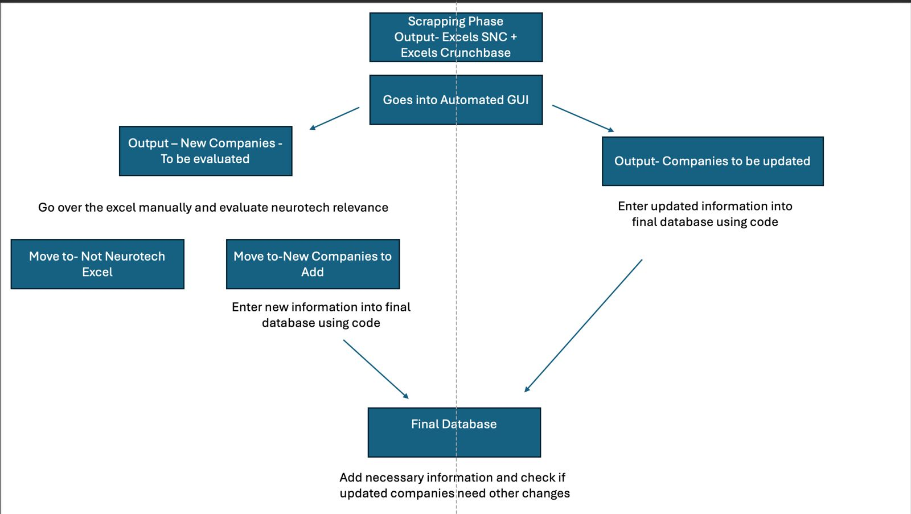
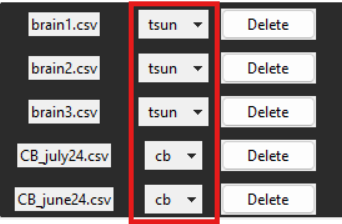

# NeuroFinder Processing Tool ⚙️


**The NeuroFinder Processing Tool** automates the management of a comprehensive neurotechnology-focused company database. It imports, standardizes, validates, and updates company data from multiple sources (e.g., CSV, Excel) and streamlines the process of identifying new companies, verifying neurotech status, collecting logos/URLs, and generating annual reports.
 
*Visit the live website: [brainstormil.com/neuro-finder](https://www.brainstormil.com/neuro-finder)*

## Table of Contents

1. [Key Features](#key-features)  
2. [Workflow Overview](#workflow-overview)  
   1. [Data Acquisition](#0-data-acquisition)  
   2. [Database Update](#1-database-update)  
   3. [New Company Identification](#2-new-company-identification)  
   4. [Neurotech Status Verification](#3-neurotech-status-verification)  
   5. [Logo and URL Collection](#4-logo-and-url-collection)  
   6. [Finder Website Update](#5-finder-website-update)  
   7. [Annual Report](#6-annual-report)  
3. [Usage](#usage)
4. [Folder Structure](#folder-structure)  
5. [Contributing](#contributing)  
6. [License](#license)

## Key Features
- **Automated Data Processing**: Imports and consolidates data from multiple sources (Crunchbase, Startup Nation Central, etc.).
- **Data Validation & Cleanup**: Standardizes and validates company info for consistent quality.
- **Neurotech Classification**: Flags potential neurotech companies for manual review.
- **Logo & URL Retrieval**: Automates corporate logo collection and URL updates.
- **Annual Reporting**: Generates a comprehensive yearly report of all findings.

## 🔄 Workflow Overview



### 0. Data Acquisition
- **Sources**:  
  - **Crunchbase**: [Crunchbase Discover](https://www.crunchbase.com/discover/organization.companies/faa124b91c5c4a8f27dac94b4c96279c)  
  - **Startup Nation Central**: [Finder Website](https://finder.startupnationcentral.org/startups/search?&status=Active)  
  - **⚠️ Note**: As of January 2025, each keyword/page must be downloaded separately.
 


### 1. Database Update
- **Task**: Ingest the acquired CSV/Excel files into the GUI and generate an update file.
- **Manual Action**: Integrate the updates into the main database.

### 2. New Company Identification
- **Task**: Load files through the GUI to export a list of newly detected companies.
- **Note**: Ensure the main database is current before running this step.

### 3. Neurotech Status Verification
- **Task**: Review the *not evaluated* file to classify each company as neurotech or non-neurotech.
- **Action**: Fill in missing info (e.g., sector, website) through online research.

### 4. Logo and URL Collection
- **Task**: Add company logos to the shared folder and use the GUI to update URLs in the database.

### 5. Finder Website Update
- **Task**: Upload the updated database to the [Finder website](https://www.brainstormil.com/neuro-finder).

### 6. Annual Report
- **Task**: Generate an annual report using the latest validated data.


## 📝 Usage
1. **Acquire Data**: Download CSV files (Crunchbase, Startup Nation Central) using relevant keywords.

### CrunchBase:


- **Edit the filter:**  
  - **Headquarters Location:** Israel  
  - **Description Keywords:** `['brain', 'mental health', 'psychology', 'neurotech', 'cognitive', 'neuroscience', 'cognition', 'neuro', 'bci', 'neuroimaging', 'synapse']`

    
- **Export the file and save the file!:**  


### The Start-Up Nation Central


- **Go to:** [The Start Up Nation Finder](https://finder.startupnationcentral.org/startups/search?&status=Active)

- **Edit the filter for each keyword and download the CSV (red squares):**


- **⚠️Note:⚠️** As of **August 2024**, you'll need to download the CSV file for each keyword separately. Additionally, each page must be downloaded individually for example:
    ```bash
    files_names = ['cognition1.csv', 'cognition2.csv', 'cognition3.csv']
    ```

- **Export the file and save the file!:**  


2. **Run GUI**: Start `frontend.py` to open the tool’s interface.


3. **Upload Files**: Click **"Upload file or Drag files here"** and classify files

    - **Classify** each file for it's original databse (red circle):

  

  4. **Export**:  
   - **Update**: Generate a file with updated companies and integrate changes into the main database.  
   - **New Companies**: Generate a file listing newly identified companies.

5. **Manual Checks**: Validate neurotech classification and fill missing info. (manually)

6. **Logos/URLs**: Add logos, generate URLs, and update the main database.

7. **Deploy**: Upload the final database to the Finder website.

8. **Report**: Generate the annual report. (needs to be added in R)


# 📁 Folder Structure and File Descriptions

### main Directory
* backend.py: Handles the core logic for processing, updating and exporting the database.
* frontend.py: Manages the graphical user interface (GUI) aspects of the tool. It allows users to interact with the tool, upload files, classify data, and perform other tasks visually.
* constants.py: Contains constant variables and configuration settings used throughout the project.

### project_images Directory
Contains images used in the entire project such as logos, flowcharts, and the GUI.

## Contributing 🤝
Contributions to improve or expand this tool are welcome. Please follow these steps:
1. **Fork** the repository.
2. **Create** a new branch for your feature or fix.
3. **Commit** your changes with a clear message.
4. **Open** a Pull Request describing your updates.

## License
Feel free to use or adjust this code for your own projects. The website and database content are handled by [Brainstorm IL](https://www.brainstormil.com). .  
If you build on or modify these materials, please mention the original source and share improvements if they might help others!


---  