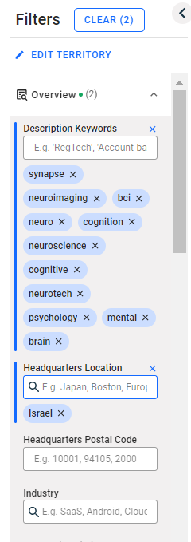
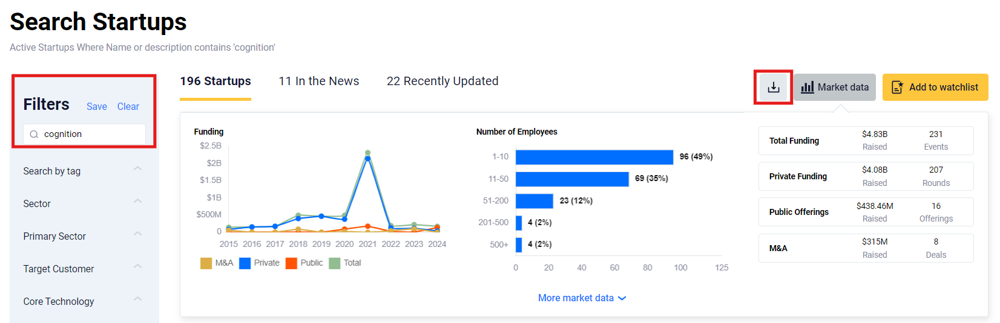
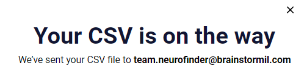
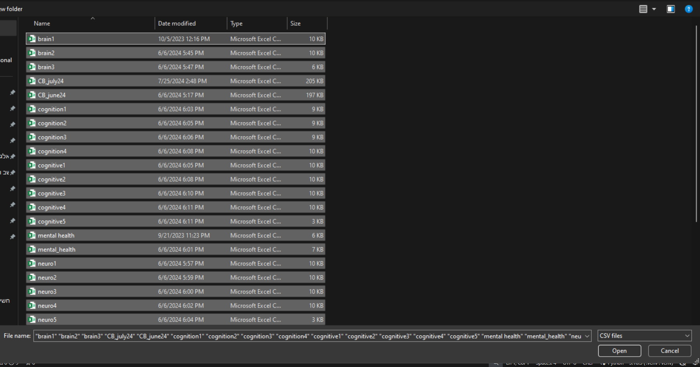

# NeuroFinder Processing Tool


The **NeuroFinder Processing Tool** automates the management of a comprehensive database containing company information related to neurotechnology. This tool facilitates the import, standardization, validation, and updating of company data files in multiple formats (e.g., CSV, Excel). The process workflow is illustrated in the flowchart provided below.

## 🚀 Workflow Overview
0. **Data Acquisition:** Retrieve databases from Startup Nation Central, Crunchbase, and more when possible.
1. **Database Update (automated):** Update the existing database with the latest information.
2. **New Company Search (automated):** Identify and add new companies to the database.
3. **Neurotech Status Verification:** Verify neurotech status and complete missing information.
4. **Logo and URL Collection (automated):** Obtain company logos and URLs.
5. **Finder Website Update:** Update the Finder website with the latest data.
6. **Annual Report Preparation (automated):** Generate the annual report

## 📝 Detailed Steps


### 0. Data Acquisition

- **Task:** Download CSV files from the Startup Nation Central and Crunchbase databases.

- **Keywords:** Utilize the following keywords for searches:

### CrunchBase:


- **Go to:** [Crunchbase Discover](https://www.crunchbase.com/discover/organization.companies/faa124b91c5c4a8f27dac94b4c96279c)

- **Edit the filter:**  
  - **Headquarters Location:** Israel  
  - **Description Keywords:** `['brain', 'mental health', 'psychology', 'neurotech', 'cognitive', 'neuroscience', 'cognition', 'neuro', 'bci', 'neuroimaging', 'synapse']`


### The Start-Up Nation Central

- **Edit the filter for each keyword and download the CSV (red squares):**


- **⚠️ Notice:** As of **August 2024**, you'll need to download the CSV file for each keyword separately. Additionally, each page must be downloaded individually, which may result in fewer results per keyword:

```bash
files_name = ['cognition1.csv', 'cognition2.csv', 'cognition3.csv']
```




### 1. Database Update
* **Task:** Load the acquired files into the GUI program and generate an update file.
* **Manual Action:** Manually update the companies listed in the generated update file.
### GUI program
- **Click the "Upload file or Drag files here" button:**  
  - Upload the files that you got from CB and TSUN. 
  - **Description Keywords:** `['brain', 'mental health', 'psychology', 'neurotech', 'cognitive', 'neuroscience', 'cognition', 'neuro', 'bci', 'neuroimaging', 'synapse']`
  


- **Classify** each file for it's original databse (red circle):


### 2. New Company Identification
* **Task:** Load the files into the GUI program and export a list of newly identified companies.


### 3. Neurotech Status Verification (Manual)
* **Task:** Review the new companies' file and classify each company as neurotech or non-neurotech according to the definitions provided in the shared drive.
* **Additional Action:** Fill in any missing information through internet searches.

### 4. Logo and URL Collection
* **Task:** Manually search for and add company logos to the visualization folder in the shared drive (ensure the company name is exact).
* **Task:** Upload the current database and images into the GUI program to generate URLs.

### 5. Finder Website Update
* **Task:** Upload the updated database to the Finder website.

### 6. Annual report*
* **Task:** Compile and prepare the annual report with the gathered information.


